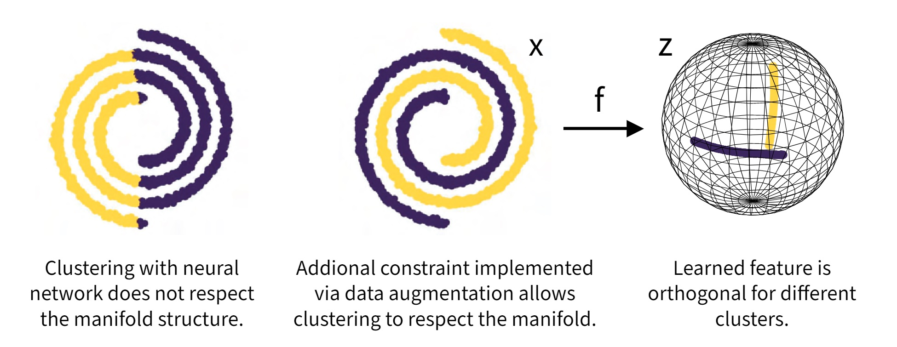

# Neural Manifold Clustering and Embedding (NMCE)
Code for paper [Neural Manifold Clustering and Embedding (NMCE)](https://arxiv.org/abs/2201.10000)

<p align="center">
  
</p>

NMCE uses [MCR2 objective](https://proceedings.neurips.cc/paper/2020/hash/6ad4174eba19ecb5fed17411a34ff5e6-Abstract.html) to perform unsupervised clustering and embedding learning on non-linear manifolds. Data-augmentation is used to enforce constraint that makes the problem tractable. In the example above, the locality constraint is enforced with Gaussian noise augmentation, for image clustering, standard self-supervise learning augmentation is used.

## Requirements
scipy\
numpy\
torch\
sklearn\
matplotlib\
torchvision\
tqdm

## Experiments
The double spiral toy example is included in NMCE_toy.

### COIL20 and COIL100:

First, decompresse the original datasets and run the following command to convert them:
```bash
python NMCE/convert_imgs.py --COIL_20_path /path_to_coil-20 --COIL_100_path /path_to_coil-100
```
Train COIL-20:
```bash
python NMCE/train_COIL20.py
```
Train COIL-100 (will take a while):
```bash
python NMCE/train_COIL100.py
```

### CIFAR-10 with ResNet-18:

To select which GPU(s) to use, pass list of gpus to --gpu_ids argument. Specify path to dataset with --data_dir argument

Stage 1: Self-supervised learning with TCR (Total Coding Rate) objective:
```bash
python NMCE/train_selfsup.py --arch resnet18cifar --data cifar10 --data_dir ../../data/ --aug_name cifar_simclr_norm --loss totalcodingrate --z_dim 128 --epo 600 --bs 1024 --lr 0.3 --wd 1e-4 --eps 0.2 --z_weight 30. --gpu_ids [0] --fp16 --doc tcr_zw30
```
Evaluate network trained with TCR:
```bash
python NMCE/evaluate.py --arch resnet18cifar --data cifar10 --aug_name cifar_simclr_norm --feature_type proj --z_dim 128 --load_ep 600  --gpu_ids [0] --aug_avg 16 --doc tcr_zw30 --svm --knn --nearsub
```
Stage 2: Clustering with backbone frozen:
```bash
python NMCE/train_clustering.py --arch resnet18cifar --data cifar10 --data_dir ../../data/ --aug_name cifar_simclr_norm --z_dim 128 --epo 100 --bs 1024 --lr 0.3 --eps 0.2 --z_weight 0. --wd1 0.005 --wd2 0.005 --gpu_ids [0] --doc tcr_zw30 --load_ep 600 --seed 42
```
Stage 3: Fine-tune backbone with full NMCE objective:
```bash
python NMCE/train_clustering.py --arch resnet18cifar --data cifar10 --data_dir ../../data/ --aug_name cifar_simclr_norm --z_dim 128 --epo 100 --bs 1024 --lr 0.003 --eps 0.2 --z_weight 0. --wd1 0.0001 --wd2 0.0001 --gpu_ids [0] --doc tcr_zw30 --load_ep 700 --train_backbone 
```
Cluster accuracy should be ~83%.
### Acknowledgment: 

This repo borrowed significantly from [MCR2](https://github.com/Ma-Lab-Berkeley/MCR2) and [solo-learn](https://github.com/vturrisi/solo-learn) repo.